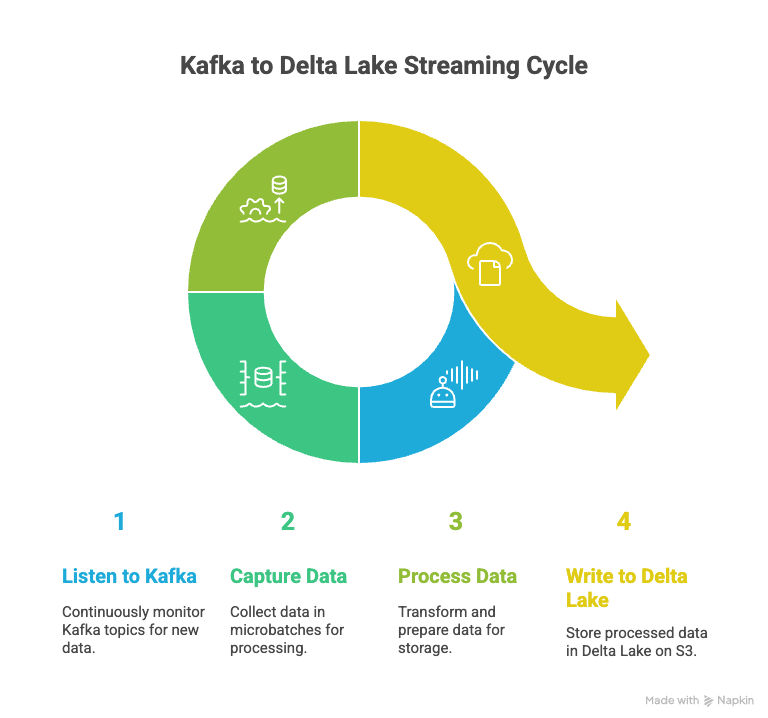
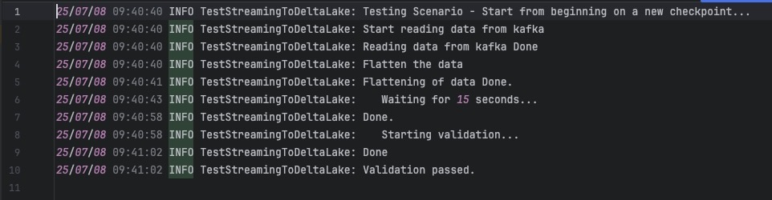

# DeltaTableS3Streaming
Real-Time Kafka to Delta Lake Pipeline using PySpark | A PySpark streaming solution, that ingests JSON data from Apache Kafka, performs transformations and validations, and writes to Delta Lake on AWS S3, using Spark Structured Streaming.


## Key Features:
1. Application logging (log4j) enabled

2. Ready to use kafka messages producer
3. Test case sample included

## Prerequisites:
1. Kafka Cluster: Deploy kafka cluster on the local machine, or create one at confluent.cloud . Keep the cluster connection username and password (api keys) ready to use.
2. install packages from requirement.txt

## How to deploy and make it work?
Configure the application by generating the .env file with required info
```
topic = <kafka topic name>
bootstrap.servers = <kafka broker server address, if kafka on local then by default it will be localhost:9092 , if using kafka cluster from confluent cloud then one can find the address in topic -> cluster settings -> endpoints>
security.protocol = SASL_SSL <standard value, no change needed>
sasl.mechanism = PLAIN <standard value, no change needed>
sasl.username = <find it on confluent.cloud topic -> api keys | not sure how to find them on local kafka cluster>
sasl.password = <find it on confluent.cloud topic -> api keys | not sure how to find them on local kafka cluster>
client.id = <name one wants to give to the streaming client>
jass.module = org.apache.kafka.common.security.plain.PlainLoginModule <standard value, no change needed>
AWS_ACCESS_KEY = <aws access key>
AWS_SECRET_KEY = <aws secrete key>
```

Sample .env file
```
topic = invoices
bootstrap.servers = pkc-xyz.ap-south-1.aws.confluent.cloud:9092
security.protocol = SASL_SSL
sasl.mechanism = PLAIN
sasl.username = TSAAAAVRRRRRPPR4
sasl.password = qEEEEE++7Y4eMQKJboaNZwXXXXXkj9DwfT+prW+olLLLLLGtMf33333ro97/4ZHX
client.id = btb-labs-client
jass.module = org.apache.kafka.common.security.plain.PlainLoginModule
AWS_ACCESS_KEY = AXXXXXXOX4AAAAAAYBJH
AWS_SECRET_KEY = O666RsTd3uCCCCCCCCCCERtLAyzVnAQQQQQq4+Zu
```

Steps to Run the application:
1. Populate the data in the kafka topic by running KafkaProducer.py script
2. Run the TestStreamingToDeltaLake.py test suite. **Note** `Testcase is designed to be passed for the exact same number of records which are there in data file (1590). Test case will fail if one ingests more data in a kafka topic and in the table, which is expected.`
